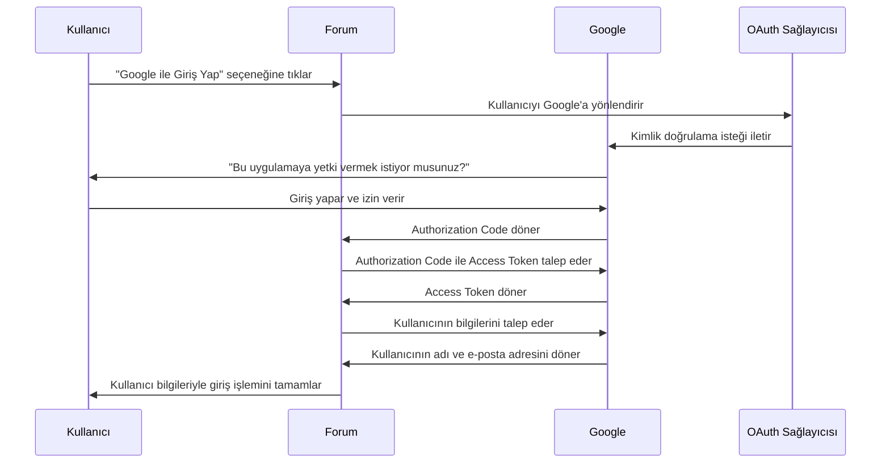
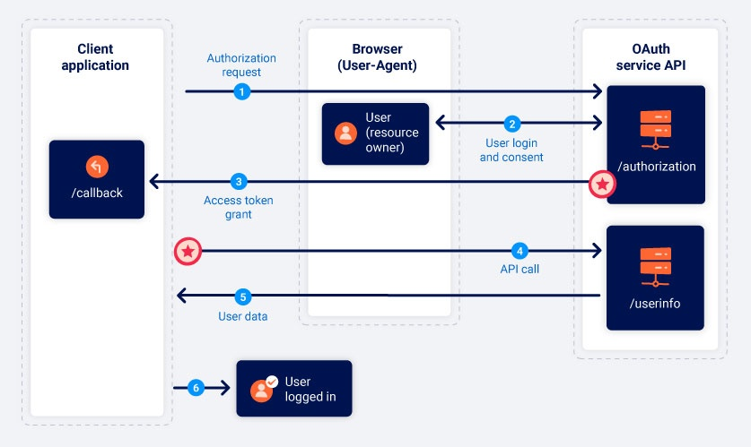
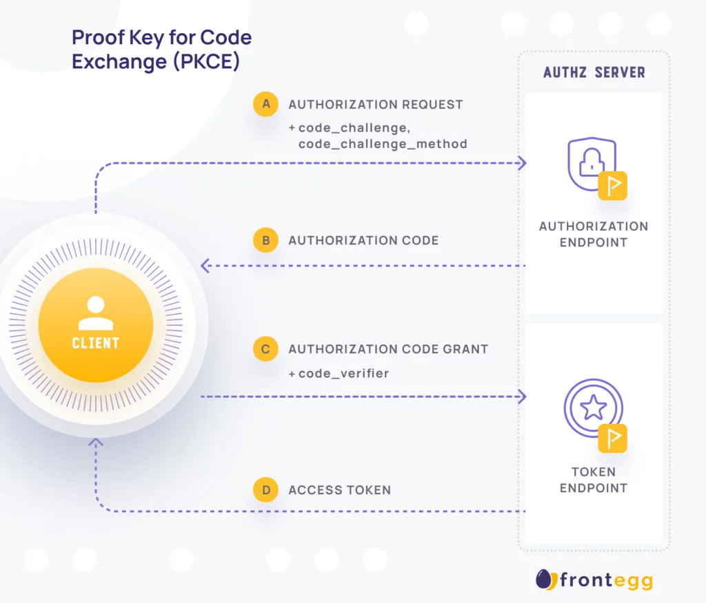

# OAuth
Muhtemelen sosyal medya hesabınızı kullanarak giriş yapmanıza izin veren sitelerle karşılaşmışsınızdır. Bu özelliğin,  OAuth 2.0  kullanılarak oluşturulmuş olma ihtimali yüksektir.

* web sitelerinin ve web uygulamalarının başka bir uygulamadaki bir kullanıcının hesabına sınırlı erişim talep etmesini sağlayan yaygın olarak kullanılan bir yetkilendirme çerçevesidir. 

*  kullanıcı adı ve şifre paylaşmadan bir uygulamanın başka bir uygulamaya güvenli bir şekilde erişim izni vermesini sağlayan yetkilendirme protokolüdür.

* Örneğin, "Google ile Giriş Yap" veya "Discord ile Bağlan" gibi işlemler OAuth 2.0 ile gerçekleştirilir.

* Kullanıcı şifresini doğrudan paylaşmaz, bunun yerine Access Token kullanılır.

#### ÖRNEK

▶️ Kullanıcı bir uygulamaya giriş yapmak ister → Örneğin, bir sitenin giriş  forumuna "Google ile Giriş Yap" seçeneği eklediniz.

▶️ Forum, OAuth sağlayıcısına yönlendirme yapar → Kullanıcı Google’a yönlendirilir.

▶️ Kullanıcı giriş yapar ve izin verir → Google, "Bu uygulamaya yetki vermek istiyor musunuz?" diye sorar.

▶️ Google, forum sitesine bir Authorization Code döner → Bu kod, tek kullanımlıktır ve kullanıcıyı temsil eder.

▶️ Forum, Authorization Code ile Google’dan Access Token alır → Sunucu tarafından yönetilir.

▶️ Forum, Access Token ile kullanıcının verilerine güvenli şekilde erişebilir → Örneğin, kullanıcının adını ve e-posta adresini alabilir.

🔹 Önemli: OAuth sadece yetkilendirme yapar, kimlik doğrulama için OpenID Connect (OIDC) kullanılır.

Gerçek OAuth sürecinin uygulanabileceği çok sayıda farklı yol vardır. Bunlar OAuth **"akışları"(flows)** veya **"hibe türleri"**(grant types) olarak bilinir. 
Her biri farklı karmaşıklık ve güvenlik hususları düzeylerine sahip birkaç farklı hibe türü vardır. 

OAuth 2.0 Akış (Flow) Türleri/ hibe türleri(grant types)

⭐ Authorization Code Flow (Yetkilendirme Kodu Akışı)

✅ En güvenli yöntemdir.

✅ Sunucu tarafında kimlik doğrulama yapılır, token istemciye doğrudan verilmez.

🔹 Nasıl Çalışır?

* Kullanıcıya, talep edilen erişime izin verip vermediği sorulur. 

* Eğer kullanıcı kabul ederse, istemci uygulamaya bir "yetkilendirme kodu" (authorization code) verilir.

* Daha sonra istemci uygulama, bu kodu OAuth hizmeti ile değiştirerek bir access token alır. 

* Bu erişim belirteci, API çağrıları yaparak ilgili kullanıcı verilerini almak için kullanılır.

* Güvenli bir kanal kurulur bu OAuth  ilk defa kurulunca

**Token sunucuda saklanır (güvenli).**

[portswigger][2]

⭐ **2. Implicit Grant (Dolaylı Yetkilendirme Akışı)**

Önce bir authorization code (yetkilendirme kodu) alıp sonra bunu bir erişim belirteciyle değiştirmek yerine, istemci uygulaması erişim belirtecini kullanıcı onayını verdikten hemen sonra alır.

* Çok daha az güvenlidir.  
* Tüm iletişim tarayıcı yönlendirmeleri aracılığıyla gerçekleşir.-
* Authorization Code Flowda olduğu gibi güvenli bir arka kanal yoktur.

[portswigger][2]

⭐ 3.**Proof Key for Code Exchange (PKCE)**

Bu Authorization flowla benzer şekilde çalışıyor. Authorization request gönderdiği zaman

Özellikle mobil ve tek sayfa uygulamalar (SPA) gibi güvenilmeyen istemciler için geliştirilmiştir.

✅ PKCE, yetkilendirme kodunun çalınmasını engeller.

[frontegg][2]

🛠 PKCE Süreci,

Uygulama rastgele bir "code verifier" oluşturur.

Bu, rastgele uzun bir string’dir.

2️⃣ "Code verifier"’ın [SHA-256](#sha-256)
 hash’i alınır ve code challenge oluşturulur.

3️⃣ Uygulama, OAuth sağlayıcısına yönlendirilirken code challenge'ı da gönderir.

4️⃣ OAuth sağlayıcısı yetkilendirme kodu üretir ve uygulamaya döndürür.

5️⃣ Uygulama bu kodu alıp, code verifier ile birlikte sunucuya gönderir.

6️⃣ OAuth sunucusu, gelen code verifier ile hash’lenmiş code challenge'ı karşılaştırır. Eğer eşleş

⭐ 4.**Client Credentials Grant**

 Kullanıcı etkileşimi gerektirmez ve yalnızca istemci (uygulama) ile yetkilendirme sunucusu arasında gerçekleşir.

🛠 Client Credentials Grant Nasıl Çalışır?
1️⃣ Uygulama, client_id ve client_secret ile OAuth sunucusuna access token almak için bir istek yapar.

2️⃣ OAuth sunucusu istemciyi doğrular ve bir access token döndürür.

3️⃣ Uygulama bu token’ı kullanarak API’ye erişim sağlar.

⭐ **4. Resource Owner Password Credentials Grant (Kullanıcı Parolası Akışı)**

Kullanım Alanı: Güvenilir istemciler (Mobil ve masaüstü uygulamalar)

🛠 Nasıl Çalışır?

Kullanıcı, doğrudan istemciye (uygulamaya) kullanıcı adı ve şifresini girer.

Uygulama, bu kimlik bilgilerini kullanarak access token alır.

Dezavantajı: Kullanıcının şifresini istemciye vermesi gerektiği için güvenli değildir. Yerine Authorization Code + PKCE önerilir.

| **OAuth Grant Türü**            | **+ Avantajlar**                                                                                                                                               | **- Dezavantajlar**                                                                                                                                         |
|----------------------------------|----------------------------------------------------------------------------------------------------------------------------------------------------------------|------------------------------------------------------------------------------------------------------------------------------------------------------------|
| **Authorization Code Grant**     | ✅ Yüksek güvenlik sağlar (PKCE ile)   ✅ Kullanıcı etkileşimi gerektirir, güvenlik için en iyi yöntem.   ✅ Mobil ve web uygulamaları için uygundur.        | ❌ Daha karmaşık, işlem adımları fazladır.   ❌ Kullanıcı oturum açma gerektirir.   ❌ Çoğu zaman backend gerektirir.                                  |
| **Implicit Grant**               | ✅ Hızlı ve basittir.   ✅ Genellikle tek sayfa uygulamaları (SPA) için uygundur.   ✅ Client secret gerektirmez.                                           | ❌ Daha az güvenli, token tarayıcıda görünür.   ❌ Refresh token kullanılamaz.   ❌ Token ömrü kısadır.                                                |
| **Resource Owner Password Credentials Grant (Password Grant)** | ✅ Kullanıcı adı ve şifre ile hızlı erişim sağlar.   ✅ Client secret gerektirmez.   ✅ Backend uygulamaları için uygundur.                                  | ❌ Kullanıcı adı ve şifreyi güvenli bir şekilde iletmek gerekir.   ❌ Kullanıcı bilgilerini doğrudan istemciye göndermek güvenlik açığı oluşturur.        |
| **Client Credentials Grant**     | ✅ Kullanıcı etkileşimi gerektirmez.   ✅ Makine arası iletişim için uygundur.   ✅ API'ler ve mikro hizmetler için idealdir.                               | ❌ Kullanıcı kimliği doğrulama yoktur, sadece istemci doğrulaması yapılır.   ❌ Client secret saklanması gerekmektedir, istemci tarafında risk olabilir.   |
| **Device Authorization Grant**   | ✅ Cihaz tabanlı uygulamalar için uygundur.   ✅ Kullanıcı etkileşimi gerektirmez.   ✅ Cihazlarda (TV, oyun konsolu vb.) kullanım kolaylığı sağlar.            | ❌ Kullanıcı, farklı bir cihazda doğrulama yapması gerektiği için işlem adımları fazladır.   ❌ Zaman aşımı durumunda işlem tekrarlanabilir.               |
| **Refresh Token Grant**          | ✅ Token süresi dolmuş olsa bile sürekli erişim sağlar.   ✅ Kullanıcı tekrar giriş yapmadan sürekli erişim sağlar.                                              | ❌ Refresh token’lar çalındığında, sürekli erişim sağlanabilir.   ❌ Ekstra güvenlik önlemleri gerektirir.                                                |

# OpenID

OpenID, kullanıcıların kimlik doğrulaması yapmak için kullanılan bir açık standarttır.

 OAuth 2.0 ile birlikte çalışır.

OpenID, genellikle tek oturum açma  ve kimlik doğrulama işlemleri için kullanılır.

OpenID, OAuth 2.0’ın üstünde çalışan bir protokoldür. OAuth, yetkilendirme sağlar, ancak OpenID bunun üstüne kimlik doğrulaması ekler.

🛠 OpenID Nasıl Çalışır?

1️⃣ Kullanıcı Uygulamaya Giriş Yapmak İster
Kullanıcı, uygulamaya giriş yapmak için OpenID sağlayıcısına (örneğin, Google, Facebook) yönlendirilir.

2️⃣ Kimlik Sağlayıcısına Yönlendirme

3️⃣ Kimlik Doğrulama
Kimlik sağlayıcısı kullanıcının kimliğini doğrular. Eğer doğruysa, bir ID token (kimlik belirteci) ve istek üzerine access token döndürülebilir.

4️⃣ Token Dönüşü
Uygulama, aldığı ID token ile kullanıcının kimliğini doğrular ve ona özel bir oturum başlatır.

OAuth 2.0, kullanıcının kaynaklarına erişim izni verir. Ancak kimlik doğrulaması yapmaz.

OpenID OAuth 2.0 üzerine et bir katman ekler.

**OpenID Connect (OIDC) Nedir?**
OpenID ve OAuth birleştirilmiş versiyonuna denir.

📌OpenID ile Kimlik Sağlayıcılar (Identity Providers)
* Google

* Facebook

* Microsoft

* GitHub

*  Okta

* Auth0

ÖZETLE
| **Protokol**         | **Yetkilendirme** | **Kimlik Doğrulama** |
|----------------------|--------------------|----------------------|
| **OAuth 2.0**        | ✅                 | ❌                   |
| **OpenID Connect**   | ✅                 | ✅                   |

[1]: https://www.researchgate.net/figure/Sequence-Diagram-of-Interaction-with-Our-OAuth2-authorization-RESTful-Feed-Sharing-Service_fig3_272823002

[2]: https://portswigger.net/web-security/oauth/grant-types

[3]: https://frontegg.com/blog/oauth-grant-types
#### **SHA-256**
(Secure Hash Algorithm 256-bit anlamına gelir ve bir kriptografik hash fonksiyonudur. Veriyi belirli bir uzunlukta ve benzersiz bir şekilde özetlemek için kullanılır.)

### KAYNAKÇA
----

* [Researchgate](https://www.researchgate.net/figure/Sequence-Diagram-of-Interaction-with-Our-OAuth2-authorization-RESTful-Feed-Sharing-Service_fig3_272823002)

* [frontegg](https://frontegg.com/blog/oauth-grant-types)

* [oauth](https://oauth.net/2/grant-types/client-credentials/)

* [auth0](https://auth0.com/docs/get-started/authentication-and-authorization-flow/client-credentials-flow)