# Oauth
Muhtemelen sosyal medya hesabınızı kullanarak giriş yapmanıza izin veren sitelerle karşılaşmışsınızdır. Bu özelliğin,  OAuth 2.0  kullanılarak oluşturulmuş olma ihtimali yüksektir.

* web sitelerinin ve web uygulamalarının başka bir uygulamadaki bir kullanıcının hesabına sınırlı erişim talep etmesini sağlayan yaygın olarak kullanılan bir yetkilendirme çerçevesidir. 

*  kullanıcı adı ve şifre paylaşmadan bir uygulamanın başka bir uygulamaya güvenli bir şekilde erişim izni vermesini sağlayan yetkilendirme protokolüdür.

* Örneğin, "Google ile Giriş Yap" veya "Discord ile Bağlan" gibi işlemler OAuth 2.0 ile gerçekleştirilir.

* Kullanıcı şifresini doğrudan paylaşmaz, bunun yerine Access Token kullanılır.

#### ÖRNEK

```mermaid
sequenceDiagram
    participant Kullanıcı
    participant Forum
    participant Google
    participant OAuth as OAuth Sağlayıcısı

    Kullanıcı->>Forum: "Google ile Giriş Yap" seçeneğine tıklar
    Forum->>OAuth: Kullanıcıyı Google'a yönlendirir
    OAuth->>Google: Kimlik doğrulama isteği iletir
    Google->>Kullanıcı: "Bu uygulamaya yetki vermek istiyor musunuz?"
    Kullanıcı->>Google: Giriş yapar ve izin verir
    Google->>Forum: Authorization Code döner
    Forum->>Google: Authorization Code ile Access Token talep eder
    Google->>Forum: Access Token döner
    Forum->>Google: Kullanıcının bilgilerini talep eder
    Google->>Forum: Kullanıcının adı ve e-posta adresini döner
    Forum->>Kullanıcı: Kullanıcı bilgileriyle giriş işlemini tamamlar
```

▶️ Kullanıcı bir uygulamaya giriş yapmak ister → Örneğin, bir sitenin giriş  forumuna "Google ile Giriş Yap" seçeneği eklediniz.

▶️ Forum, OAuth sağlayıcısına yönlendirme yapar → Kullanıcı Google’a yönlendirilir.

▶️ Kullanıcı giriş yapar ve izin verir → Google, "Bu uygulamaya yetki vermek istiyor musunuz?" diye sorar.

▶️ Google, forum sitesine bir Authorization Code döner → Bu kod, tek kullanımlıktır ve kullanıcıyı temsil eder.

▶️ Forum, Authorization Code ile Google’dan Access Token alır → Sunucu tarafından yönetilir.

▶️ Forum, Access Token ile kullanıcının verilerine güvenli şekilde erişebilir → Örneğin, kullanıcının adını ve e-posta adresini alabilir.

🔹 Önemli: OAuth sadece yetkilendirme yapar, kimlik doğrulama için OpenID Connect (OIDC) kullanılır.

Gerçek OAuth sürecinin uygulanabileceği çok sayıda farklı yol vardır. Bunlar OAuth **"akışları"(flows)** veya **"hibe türleri"**(grant types) olarak bilinir. 
Her biri farklı karmaşıklık ve güvenlik hususları düzeylerine sahip birkaç farklı hibe türü vardır. 

OAuth 2.0 Akış (Flow) Türleri/ hibe türleri(grant types)

1️⃣ Authorization Code Flow (Yetkilendirme Kodu Akışı)

✅ En güvenli yöntemdir.

✅ Sunucu tarafında kimlik doğrulama yapılır, token istemciye doğrudan verilmez.

🔹 Nasıl Çalışır?

Kullanıcı giriş yapar → Yetkilendirme kodu alınır.

Yetkilendirme kodu ile Access Token talep edilir.

Token sunucuda saklanır (güvenli).

🔹 Kullanım Alanı: Web ve mobil uygulamalar.

[portswigger][2]

[1]: https://www.researchgate.net/figure/Sequence-Diagram-of-Interaction-with-Our-OAuth2-authorization-RESTful-Feed-Sharing-Service_fig3_272823002

[2]: https://portswigger.net/web-security/oauth/grant-types

### KAYNAKÇA
----

* [Researchgate](https://www.researchgate.net/figure/Sequence-Diagram-of-Interaction-with-Our-OAuth2-authorization-RESTful-Feed-Sharing-Service_fig3_272823002)

